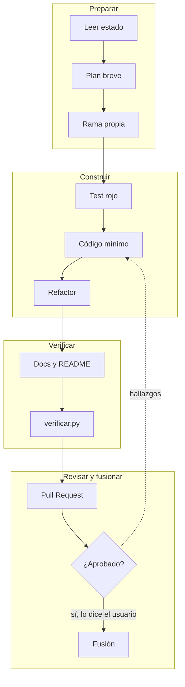

# Ciclo de trabajo de un cambio

### Ciclo de trabajo de un cambio

¿Qué pasos sigue un cambio desde que se pide hasta que se fusiona?

```mermaid
flowchart TB
    subgraph P["Preparar"]
        A["Leer estado"] --> B["Plan breve"] --> C["Rama propia"]
    end
    subgraph K["Construir"]
        D["Test rojo"] --> E["Código mínimo"] --> F["Refactor"]
    end
    subgraph V["Verificar"]
        G["Docs y README"] --> H["verificar.py"]
    end
    subgraph R["Revisar y fusionar"]
        I["Pull Request"] --> J{"¿Aprobado?"} -->|sí, lo dice el usuario| L["Fusión"]
    end
    C --> D
    F --> G
    H --> I
    J -.->|hallazgos| E
```
