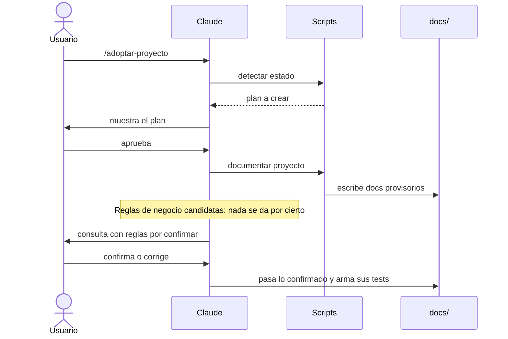

# Cómo se confirma un proyecto existente

### Cómo se confirma un proyecto existente

¿Cómo pasa un proyecto que ya existe de no tener documentación a tener requisitos confirmados y tests?

```mermaid
sequenceDiagram
    actor U as Usuario
    participant C as Claude
    participant S as Scripts
    participant D as docs/
    U->>C: /adoptar-proyecto
    C->>S: detectar estado
    S-->>C: plan a crear
    C->>U: muestra el plan
    U->>C: aprueba
    C->>S: documentar proyecto
    S->>D: escribe docs provisorios
    Note over C: Reglas de negocio candidatas: nada se da por cierto
    C->>U: consulta con reglas por confirmar
    U->>C: confirma o corrige
    C->>D: pasa lo confirmado y arma sus tests
```
