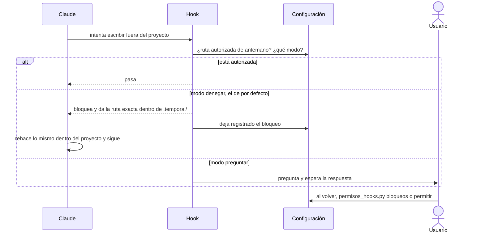

# Cómo frenan los hooks

### Cómo frenan los hooks

¿Qué pasa cuando Claude intenta escribir fuera del proyecto o editar un archivo protegido?

```mermaid
sequenceDiagram
    participant C as Claude
    participant H as Hook
    participant K as Configuración
    actor U as Usuario
    C->>H: intenta escribir fuera del proyecto
    H->>K: ¿ruta autorizada de antemano? ¿qué modo?
    alt está autorizada
        H-->>C: pasa
    else modo denegar, el de por defecto
        H-->>C: bloquea y da la ruta exacta dentro de .temporal/
        H->>K: deja registrado el bloqueo
        C->>C: rehace lo mismo dentro del proyecto y sigue
    else modo preguntar
        H->>U: pregunta y espera la respuesta
    end
    U->>K: al volver, permisos_hooks.py bloqueos o permitir
```
