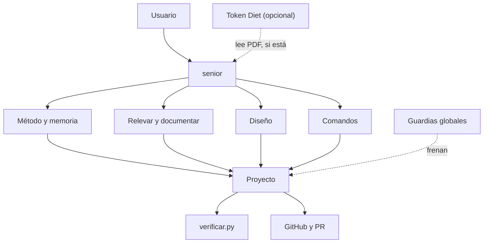

# Cómo está armado el paquete

### Cómo está armado el paquete

¿Qué skills forman el paquete, cuál es la puerta de entrada y qué vigila el trabajo?

```mermaid
flowchart TB
    U["Usuario"] --> S["senior"]
    S --> M["Método y memoria"]
    S --> R["Relevar y documentar"]
    S --> D["Diseño"]
    S --> C["Comandos"]
    M --> P["Proyecto"]
    R --> P
    D --> P
    C --> P
    P --> V["verificar.py"]
    P --> G["GitHub y PR"]
    H["Guardias globales"] -.->|frenan| P
    T["Token Diet (opcional)"] -.->|lee PDF, si está| S
```
